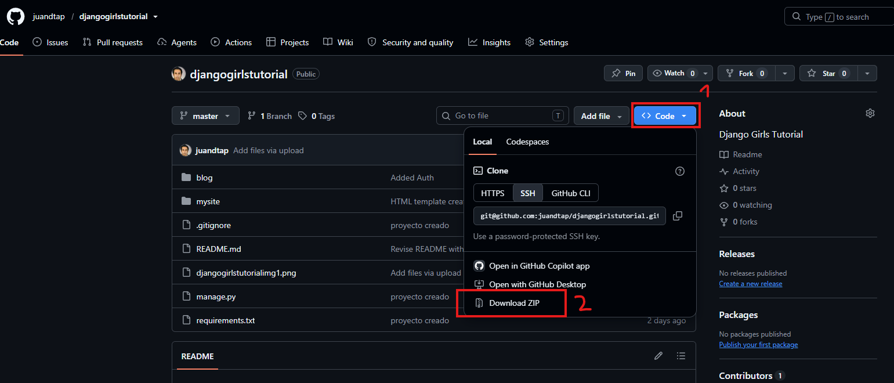

# Django Girls Tutorial
En este repositorio estan los contenidos del Tutorial de Django del evento Djangogirls 2026

## Pasos para descargarlo:

Hay dos opciones clonar y descargar el zip
### 1. Clonar
Si ya tienes configurado tu SSH Key o tu editor de codigo autenticado con github ejecuta el siguiente comando en tu terminal (ya sea Powershell, CMD o bash linux) 

``` git clone git@github.com:juandtap/djangogirlstutorial.git ```

Nota. No olvides colocarte dentro de la terminal en el directorio donde quieres tener el proyecto.

### 2. Descargar el zip
Si tienes problemas con autenticarte en github puedes descargar el repositorio como un archivo zip. Dale clic al boton de *Descargar zip* como se muestra en la imagen



## Ejecutar el codigo

Una vez tengas listo el proyecto tienes que seguir los siguientes pasos para ejecutarlo en tu PC. Pasos que recordaras del Tutorial.

### 1. Crear el ambiente virtual

Windows:

``` python -m venv myvenv```

Si tienes algun error prueba iniciando tu editor como administrador o intenta usar CMD en lugar de powershell.

Linux/MAC:

``` python3 -m venv myvenv```

### 2. Activar el ambiente virtual

Windows:
- Powershell
  ```
  ./myvenv/Scripts/activate
  ``` 
- CMD
  ```
  .\myvenv\Scripts\activate.bat
  ```
En algunos casos al cambiar de terminal a CMD en el editor Visual Code este automaticamente activa el ambiente virtual.

Si el nombre de tu ambiente  aparece entre parentesis ```(myvenv)``` significa que ya esta activo.

### 3. Instalar librerias (Django)

Recuerdas el archivo requirements.txt ?  Ejecuta el comando

```pip install -r requirements.txt```

### 4. Ejecutar

Listo ya tenemos todo preparado para ejecutar nuestro proyecto de Django con el siguiente comando.

``` python manage.py runserver ```

Ve al navegador y coloca en la barra de direcciones: ``` localhost:8000```

Para detener la ejecucion, en la terminal presiona Ctrl + c


# Despliegue en Pythonanywhere.com

Si tuviste algun inconveniente al momento del Deploy en python anywhere prueba a cambiar el numero de la version de python a 3.12 o 3.13
En el ambiente de pythonanywhere trabajan con la version 3.12 o 3.13 si se usa otras antiguas o mas recientes lanza error en la consola

```
pa_autoconfigure_django.py --python=3.12 https://github.com/tunombredeusariogithub/nombredeturepositorio
```

Ejemplo: 

```
pa_autoconfigure_django.py --python=3.12 https://github.com/juandtap/djangogirsltutorial
```

Nota1. Recuerda seguir los pasos del deploy anteriores en el Tutorial. 

Nota2. Recuerda usar tu nombre de usario y el nombre de tu repositorio si es que usaste uno distinto a djangogirlstutorial

#  Guía de Configuración e Inicio con SSH para GitHub

A continuacion tienes una guía rápida para configurar tu autenticación mediante **claves SSH** en GitHub. Usar SSH en lugar de HTTPS te permite hacer `git push` y `git pull` de forma segura sin tener que ingresar tu usuario y token/contraseña en cada ocasión.

---

##  Requisitos Previos

Asegúrate de tener **Git** instalado en tu sistema:
* **Linux:** `git --version` (Instalar vía gestor de paquetes ej. `sudo apt install git`)
* **Windows:** Instalar [Git for Windows](https://gitforwindows.org/) (incluye **Git Bash**).

---

##  Configuración en Linux

Abre tu terminal y sigue estos pasos:

### 1. Generar la clave SSH
Ejecuta el siguiente comando (reemplaza con el correo asociado a tu cuenta de GitHub):

```bash
ssh-keygen -t ed25519 -C "tu_email@ejemplo.com"
```
Presiona Enter para aceptar la ubicación por defecto y asigna una contraseña (passphrase) opcional si deseas mayor seguridad.

### 2. Iniciar el agente SSH y agregar la clave

```# Iniciar el agente SSH en segundo plano
eval "$(ssh-agent -s)"
```
```
# Agregar tu clave privada al agente
ssh-add ~/.ssh/id_ed25519
```

### 3. Copiar la clave pública para GitHub
Muestra el contenido de tu clave pública y cópialo completo:

```
cat ~/.ssh/id_ed25519.pub
```

##  Configuración en Windows
Abre Git Bash (incluido con Git for Windows) o PowerShell y sigue estos pasos:

### 1. Generar la clave SSH
```
ssh-keygen -t ed25519 -C "tu_email@ejemplo.com"
```
Presiona Enter para aceptar la ruta predeterminada (C:\Users\TuUsuario\.ssh\id_ed25519).

### 2. Iniciar el servicio SSH y agregar la clave
En Git Bash:
```
eval "$(ssh-agent -s)"
ssh-add ~/.ssh/id_ed25519
```

En PowerShell (Como Administrador):

PowerShell
```
# Asegurar que el servicio ssh-agent esté activo
Set-Service -Name ssh-agent -StartupType Automatic
Start-Service ssh-agent

# Agregar la clave
ssh-add ~$env:USERPROFILE\.ssh\id_ed25519

```
### 3. Copiar la clave pública para GitHub
En Git Bash:
```
cat ~/.ssh/id_ed25519.pub
```

En PowerShell:

```
Get-Content ~$env:USERPROFILE\.ssh\id_ed25519.pub

```

##  Agregar la Clave Pública a GitHub
Copia todo el texto generado por el comando cat o Get-Content (comienza con ssh-ed25519 ...).

Ve a tu cuenta de GitHub ➔ Settings (Configuración) ➔ SSH and GPG keys.

Haz clic en New SSH key.

Asigna un Title (ej. Laptop Trabajo, PC Escritorio Linux/Win).

En el campo Key, pega tu clave pública.

Haz clic en Add SSH key.

##  Comprobar la Conexión
Para verificar que la clave esté configurada correctamente, ejecuta el siguiente comando en tu terminal (Linux/Git Bash/PowerShell):

```
ssh -T git@github.com
```
Si todo es correcto, verás un mensaje similar a este:
```
Hi username! You've successfully authenticated, but GitHub does not provide shell access.
```


##  Clonar este Repositorio mediante SSH
Una vez configurado, clona este repositorio usando la URL SSH:

```
git clone git@github.com:usuario/nombre-del-repositorio.git
```

Si ya habías clonado el repositorio mediante HTTPS, puedes cambiar la URL a SSH con:

```
git remote set-url origin git@github.com:usuario/nombre-del-repositorio.git
```

# Notas adicionales

Si tienes inconvenites o consultas no dudes en preguntar en los grupos de Whatsapp de Djangogirls Participantes o en la comunidad de Python Ecuador en Telegram
Tambien puedes escribirme al correo tapiadiego16@gmail.com o buscar mis otros medios de contacto aqui [https://github.com/juandtap](https://github.com/juandtap)


